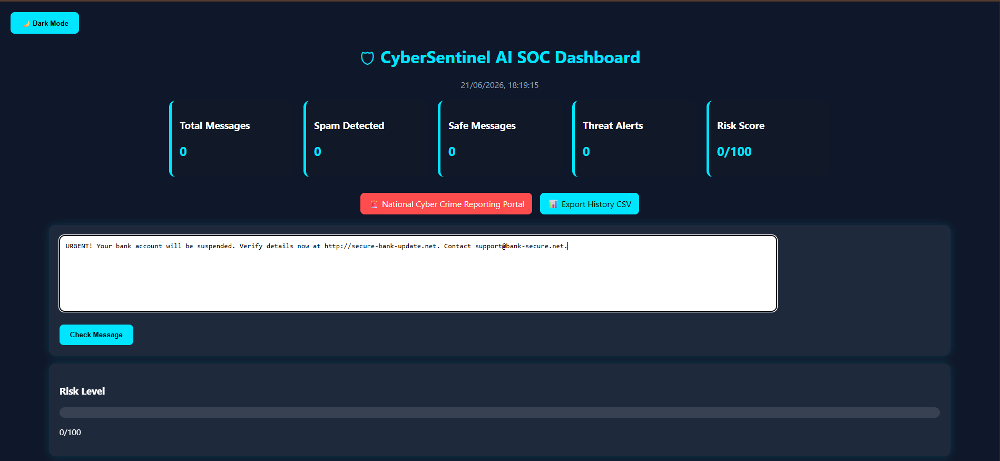
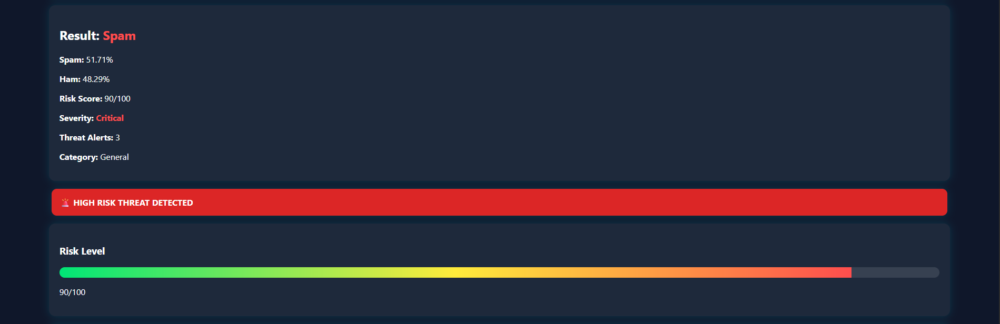
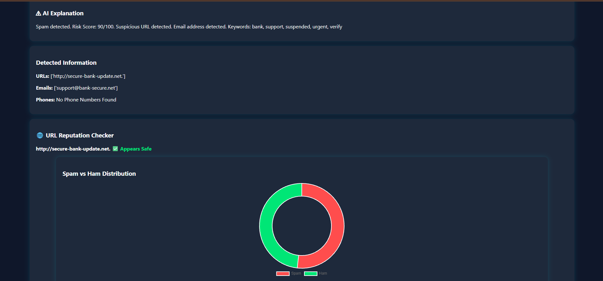

# CyberSentinel AI

## Overview

CyberSentinel AI is a Machine Learning-based web application that detects spam and potentially fraudulent text messages. The system analyzes user-entered messages and classifies them as **Spam** or **Ham (Legitimate Message)** using the **Naive Bayes Algorithm** and **TF-IDF Vectorization**. The project aims to improve cyber awareness by helping users identify suspicious messages, phishing attempts, and online scams through an interactive Flask-based dashboard.

---

## Features

* Spam and Ham message classification
* Fraud risk score calculation
* URL detection from messages
* Prediction confidence scores
* Message analysis history storage
* Interactive dashboard with charts
* CSV report export functionality
* User-friendly web interface

---

## Technologies Used

### Frontend

* HTML
* CSS
* JavaScript

### Backend

* Python
* Flask

### Machine Learning

* Naive Bayes Classifier
* TF-IDF Vectorizer
* Scikit-learn

### Database

* SQLite

### Deployment

* Render

### Version Control

* Git and GitHub

---

## Working of the Project

1. User enters a message into the system.
2. The message is preprocessed and cleaned.
3. TF-IDF converts the text into numerical features.
4. The trained Naive Bayes model analyzes the message.
5. The system predicts whether the message is Spam or Ham.
6. Fraud risk score and confidence values are displayed.
7. Results are stored in the SQLite database for future analysis.

---

## Machine Learning Model

Algorithm Used: Naive Bayes

Reason for Selection:

* Fast and efficient
* Works well for text classification
* Suitable for spam detection
* Easy to train and deploy

Feature Extraction:

* TF-IDF Vectorization

---

## Dataset

The model was trained using an SMS Spam Collection Dataset containing spam and legitimate messages.

---

## Project Structure

CyberSentinel-AI/

├── app.py

├── train_model.py

├── spam_model.pkl

├── vectorizer.pkl

├── history.db

├── templates/

├── static/

├── requirements.txt

├── Procfile

└── README.md

---

## Installation

1. Clone the repository

git clone <repository-url>

2. Install dependencies

pip install -r requirements.txt

3. Run the application

python app.py

4. Open in browser

http://127.0.0.1:5000

---

## Future Enhancements

* Deep Learning-based detection
* Real-time phishing URL analysis
* Email spam detection
* Multi-language support
* Advanced cyber threat intelligence integration

---

## Screenshots

### Home Page

### Prediction Result

### Threat Analysis & URL Detection

### Message History & Analytics

---

## Author

Ankita Yadav

B.Tech Computer Science Engineering

---

## License

This project is licensed under the MIT License.

